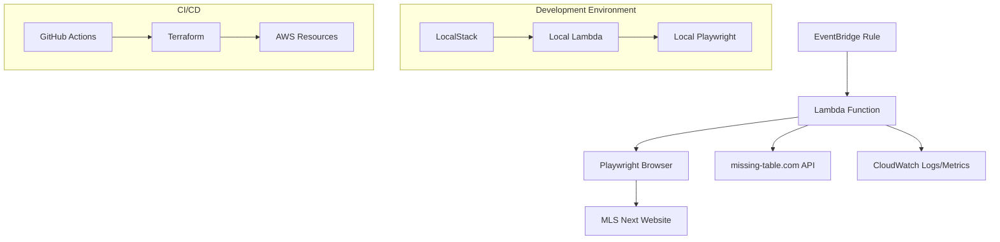

# Design Document

## Overview

The MLS Match Scraper is a serverless application that automatically scrapes match data from the MLS Next website and posts it to the missing-table.com API. The system uses AWS Lambda for compute, EventBridge for scheduling, and Playwright for web scraping. The architecture emphasizes reliability, observability, and cost-effectiveness while supporting local development through LocalStack.

## Architecture



### Key Components

1. **Lambda Function**: Core scraping logic with Playwright integration
2. **EventBridge Rule**: Scheduled trigger for automated execution
3. **CloudWatch**: Logging and metrics collection
4. **Terraform**: Infrastructure as Code for reproducible deployments
5. **GitHub Actions**: CI/CD pipeline for automated testing and deployment
6. **LocalStack**: Local AWS simulation for development and testing

## Components and Interfaces

### Lambda Function Structure

```
src/
├── lambda_function.py          # Main Lambda handler with Powertools decorators
├── scraper/
│   ├── __init__.py
│   ├── mls_scraper.py         # Core scraping logic
│   ├── date_handler.py        # Date range calculation and calendar interaction
│   └── config.py              # Environment variable handling
├── api/
│   ├── __init__.py
│   └── missing_table_client.py # API client for missing-table.com
├── utils/
│   ├── __init__.py
│   ├── logger.py              # AWS Powertools logging setup
│   └── metrics.py             # OpenTelemetry metrics emission
├── pyproject.toml             # Python dependencies, ruff, pytest, coverage config
├── .pre-commit-config.yaml    # Pre-commit hooks with tests and coverage
├── .coveragerc                # Coverage configuration file
└── uv.lock                    # Locked dependency versions
```

**Main Lambda Handler with Powertools and OpenTelemetry**:
```python
from aws_lambda_powertools import Logger, Tracer
from aws_lambda_powertools.logging import correlation_paths
from aws_lambda_powertools.utilities.typing import LambdaContext
from opentelemetry import metrics
from opentelemetry.exporter.otlp.proto.http.metric_exporter import OTLPMetricExporter
from opentelemetry.sdk.metrics import MeterProvider
from opentelemetry.sdk.metrics.export import PeriodicExportingMetricReader

logger = Logger()
tracer = Tracer()

# Initialize OpenTelemetry metrics
metric_reader = PeriodicExportingMetricReader(
    exporter=OTLPMetricExporter(),
    export_interval_millis=5000,
)
metrics.set_meter_provider(MeterProvider(metric_readers=[metric_reader]))
meter = metrics.get_meter("mls-match-scraper")

# Define metrics
games_scheduled_counter = meter.create_counter(
    name="games_scheduled_total",
    description="Total number of games scheduled",
    unit="1"
)
games_scored_counter = meter.create_counter(
    name="games_scored_total",
    description="Total number of games with scores",
    unit="1"
)

@logger.inject_lambda_context(correlation_id_path=correlation_paths.API_GATEWAY_REST)
@tracer.capture_lambda_handler
def lambda_handler(event: dict, context: LambdaContext) -> dict:
    """Main Lambda handler with Powertools and OpenTelemetry integration"""
    pass
```

### Configuration Interface

Environment variables with defaults:
- `AGE_GROUP` (default: "U14")
- `CLUB` (default: "")
- `COMPETITION` (default: "")
- `DIVISION` (default: "Northeast")
- `LOOK_BACK_DAYS` (default: "1")
- `MISSING_TABLE_API_URL` (required)
- `MISSING_TABLE_API_KEY` (required)
- `LOG_LEVEL` (default: "INFO")

OpenTelemetry/Grafana Cloud configuration:
- `OTEL_EXPORTER_OTLP_ENDPOINT` (required: https://otlp-gateway-<your-stack>.grafana.net)
- `OTEL_EXPORTER_OTLP_HEADERS` (required: Authorization=Bearer <GRAFANA_CLOUD_API_KEY>)
- `OTEL_METRICS_EXPORTER` (default: "otlp")
- `OTEL_EXPORTER_OTLP_PROTOCOL` (default: "http/protobuf")
- `OTEL_SERVICE_NAME` (default: "mls-match-scraper")
- `OTEL_SERVICE_VERSION` (default: "1.0.0")

### Scraper Interface

```python
class MLSScraper:
    def __init__(self, config: ScrapingConfig):
        self.config = config
        self.browser = None

    async def scrape_matches(self) -> List[Match]:
        """Main scraping method that returns match data"""

    async def _setup_date_filter(self, page) -> None:
        """Configure date range using calendar widget"""

    async def _apply_filters(self, page) -> None:
        """Apply age group, club, competition, division filters"""

    async def _extract_match_data(self, page) -> List[Match]:
        """Extract match information from the page"""
```

### API Client Interface

```python
class MissingTableClient:
    def __init__(self, api_url: str, api_key: str):
        self.api_url = api_url
        self.api_key = api_key

    async def create_game(self, match_data: Match) -> bool:
        """POST new game to missing-table.com"""

    async def update_score(self, game_id: str, score_data: Score) -> bool:
        """POST score update to missing-table.com"""
```

## Data Models

### Match Data Model

```python
@dataclass
class Match:
    match_id: str
    home_team: str
    away_team: str
    match_date: datetime
    match_time: Optional[str]
    venue: Optional[str]
    age_group: str
    division: str
    competition: Optional[str]
    status: str  # "scheduled", "in_progress", "completed"
    home_score: Optional[int] = None
    away_score: Optional[int] = None
```

### Configuration Model

```python
@dataclass
class ScrapingConfig:
    age_group: str
    club: str
    competition: str
    division: str
    look_back_days: int
    start_date: date
    end_date: date
```

### Metrics Model

```python
@dataclass
class ScrapingMetrics:
    games_scheduled: int
    games_scored: int
    api_calls_successful: int
    api_calls_failed: int
    execution_duration_ms: int
    errors_encountered: int
```

## Error Handling

### Retry Strategy

1. **Network Errors**: Exponential backoff with jitter (1s, 2s, 4s max)
2. **API Errors**: Retry on 5xx errors, fail fast on 4xx errors
3. **Playwright Errors**: Retry page loads, fail on browser launch issues
4. **Timeout Handling**: 30-second page load timeout, 5-minute total Lambda timeout

### Error Categories

- **Recoverable**: Network timeouts, temporary API unavailability, page load failures
- **Non-recoverable**: Authentication failures, malformed data, browser launch failures
- **Partial Failures**: Some matches scraped successfully, others failed

### Logging and Metrics Strategy

**Logging with AWS Powertools**:
Using AWS Powertools for Python to provide structured, JSON-formatted logs with automatic correlation IDs and Lambda context:

```python
from aws_lambda_powertools import Logger, Tracer
from aws_lambda_powertools.logging import correlation_paths

logger = Logger()
tracer = Tracer()

# Structured logging with automatic correlation IDs
logger.info("Starting scrape", extra={
    "config": config_dict,
    "execution_start": timestamp
})

logger.error("API call failed", extra={
    "api_endpoint": endpoint,
    "status_code": status_code,
    "retry_attempt": attempt_number
})
```

**Metrics with OpenTelemetry**:
Using OpenTelemetry SDK to emit metrics to Grafana Cloud via ADOT Lambda Layer:

```python
from opentelemetry import metrics

# Emit counter metrics
games_scheduled_counter.add(games_count, {
    "age_group": config.age_group,
    "division": config.division
})

games_scored_counter.add(scored_count, {
    "age_group": config.age_group,
    "division": config.division
})

# Emit histogram for API response times
api_duration_histogram.record(duration_ms, {
    "endpoint": "create_game",
    "status_code": str(response.status_code)
})
```

**Benefits**:
- **Powertools**: Automatic JSON formatting, correlation IDs, Lambda context
- **OpenTelemetry**: Vendor-neutral metrics, rich labeling, Grafana Cloud integration
- **ADOT Layer**: No additional dependencies, automatic instrumentation
- **Observability**: Distributed tracing with X-Ray, metrics in Grafana dashboards

## Testing Strategy

### Unit Tests

- **Scraper Logic**: Mock Playwright interactions, test data extraction
- **API Client**: Mock HTTP responses, test retry logic
- **Configuration**: Test environment variable parsing and defaults
- **Date Handling**: Test date calculations and edge cases

### Integration Tests

- **LocalStack Integration**: Test Lambda deployment and execution
- **End-to-End**: Test complete scraping workflow with mock MLS site
- **API Integration**: Test against missing-table.com staging environment

### Local Development Setup

```bash
# Start LocalStack
docker-compose up localstack

# Deploy to LocalStack
terraform init
terraform plan -var="environment=local"
terraform apply -var="environment=local"

# Test Lambda function
aws --endpoint-url=http://localhost:4566 lambda invoke \
  --function-name mls-match-scraper \
  --payload '{}' \
  response.json
```

### Performance Testing

- **Memory Usage**: Monitor Lambda memory consumption with Playwright
- **Execution Time**: Ensure completion within 5-minute Lambda limit
- **Concurrency**: Test multiple simultaneous executions
- **Browser Resource Management**: Verify proper cleanup of Playwright resources

## Deployment Architecture

### Terraform Modules

```
terraform/
├── main.tf                    # Root module
├── variables.tf               # Input variables including Grafana Cloud config
├── outputs.tf                 # Output values
├── modules/
│   ├── lambda/
│   │   ├── main.tf           # Lambda function, IAM, and ADOT layer
│   │   ├── variables.tf
│   │   └── outputs.tf
│   ├── scheduling/
│   │   ├── main.tf           # EventBridge rules
│   │   ├── variables.tf
│   │   └── outputs.tf
│   └── monitoring/
│       ├── main.tf           # CloudWatch alarms (basic) + ADOT config
│       ├── variables.tf
│       └── outputs.tf
```

**Lambda Configuration with ADOT Layer**:
```hcl
resource "aws_lambda_function" "mls_scraper" {
  filename         = "mls-scraper.zip"
  function_name    = "mls-match-scraper"
  role            = aws_iam_role.lambda_role.arn
  handler         = "lambda_function.lambda_handler"
  runtime         = "python3.9"
  timeout         = 300

  layers = [
    "arn:aws:lambda:${data.aws_region.current.name}:901920570463:layer:aws-otel-python-amd64-ver-1-20-0:1"
  ]

  environment {
    variables = {
      OTEL_EXPORTER_OTLP_ENDPOINT = var.grafana_otlp_endpoint
      OTEL_EXPORTER_OTLP_HEADERS  = "Authorization=Bearer ${var.grafana_api_key}"
      OTEL_METRICS_EXPORTER       = "otlp"
      OTEL_EXPORTER_OTLP_PROTOCOL = "http/protobuf"
      OTEL_SERVICE_NAME           = "mls-match-scraper"
      OTEL_SERVICE_VERSION        = var.service_version
      # ... other environment variables
    }
  }
}
```

### Lambda Packaging Strategy

1. **Layer Strategy**: Create Lambda layer for Playwright binaries
2. **Dependency Management**: Use uv with pyproject.toml for fast, reproducible builds
3. **Build Process**: Use uv sync to create virtual environment, then package for Lambda
4. **Size Optimization**: Exclude unnecessary files, compress artifacts
5. **Environment Separation**: Use uv groups for dev/staging/prod dependencies

### GitHub Actions Workflow

```yaml
name: Deploy MLS Match Scraper
on:
  push:
    branches: [main]
  pull_request:
    branches: [main]

jobs:
  test:
    runs-on: ubuntu-latest
    steps:
      - uses: actions/checkout@v3
      - name: Setup Python
        uses: actions/setup-python@v4
        with:
          python-version: '3.9'
      - name: Install dependencies
        run: uv sync --all-groups
      - name: Run ruff linting
        run: uv run ruff check .
      - name: Run ruff formatting check
        run: uv run ruff format --check .
      - name: Configure Powertools
        run: export POWERTOOLS_SERVICE_NAME=mls-match-scraper
      - name: Run tests with coverage
        run: uv run pytest --cov=src --cov-report=xml --cov-report=html --cov-fail-under=50
      - name: Upload coverage reports
        uses: codecov/codecov-action@v3
        with:
          file: ./coverage.xml
      - name: Run LocalStack integration tests
        run: docker-compose up -d && pytest tests/integration/

  deploy:
    needs: test
    runs-on: ubuntu-latest
    if: github.ref == 'refs/heads/main'
    steps:
      - uses: actions/checkout@v3
      - name: Setup Terraform
        uses: hashicorp/setup-terraform@v2
      - name: Terraform Init
        run: terraform init
      - name: Terraform Plan
        run: terraform plan
      - name: Terraform Apply
        run: terraform apply -auto-approve
```

## Security Considerations

### IAM Permissions

- **Minimal Permissions**: Lambda execution role with only required permissions
- **API Key Management**: Store missing-table.com API key in AWS Secrets Manager
- **Network Security**: VPC configuration if required for API access

### Data Protection

- **No PII Storage**: Match data contains no personally identifiable information
- **Encryption**: All data encrypted in transit and at rest
- **Audit Logging**: All API calls and data access logged to CloudWatch

## Monitoring and Observability

### OpenTelemetry Metrics (Grafana Cloud)

**Custom Application Metrics**:
- `games_scheduled_total` (counter): Total games found and scheduled
- `games_scored_total` (counter): Total games with scores updated
- `api_calls_total` (counter): API calls to missing-table.com with status labels
- `api_call_duration_seconds` (histogram): API response time distribution
- `scraping_duration_seconds` (histogram): Total scraping execution time
- `scraping_errors_total` (counter): Scraping errors by type

**AWS Lambda Metrics** (via ADOT auto-instrumentation):
- Duration, Errors, Throttles, Memory utilization
- Cold start metrics and initialization time

### Grafana Cloud Dashboards

**Executive Dashboard**:
- Games scheduled vs scored over time
- Success rate percentage
- Data freshness indicators
- Cost and execution trends

**Operational Dashboard**:
- Error rates and types
- API performance metrics
- Lambda performance and resource utilization
- Retry patterns and failure analysis

**Debug Dashboard**:
- Detailed error logs with correlation IDs
- Trace information from X-Ray integration
- Performance bottleneck identification

### Alerting Strategy

**Grafana Cloud Alerts**:
- **High Error Rate**: >10% of executions failing in 15-minute window
- **API Failures**: >5 consecutive API call failures
- **No Data**: No successful executions in 2 hours (indicates scheduling issues)
- **Performance Degradation**: P95 execution time >4 minutes

**CloudWatch Alarms** (backup):
- Lambda function errors and timeouts
- Memory utilization warnings
